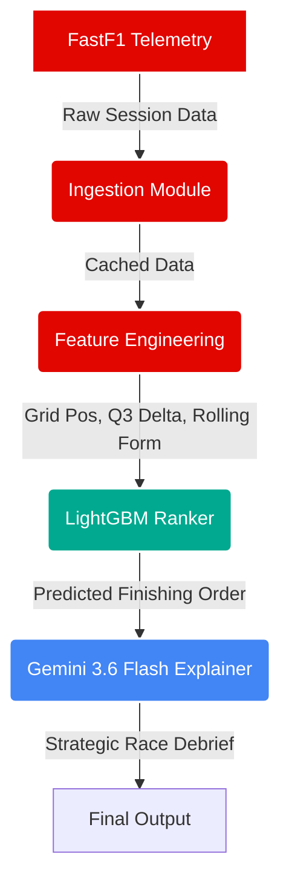

# 🏎️ F1 Race Predictor & Strategy Explainer

[](https://python.org)
[](https://lightgbm.readthedocs.io/)
[](https://docs.fastf1.dev/)
[](https://ai.google.dev/)
[](https://pytest.org/)

An end-to-end Machine Learning pipeline that predicts Formula 1 race outcomes using historical telemetry and session data. It leverages a Learning-to-Rank (LTR) model to rank drivers and integrates Google's Gemini LLM to generate strategic, tactical debriefs explaining *why* the model made its predictions.

---

## 🏗️ Architecture



---

## 📊 Model Evaluation Summary

Our `LGBMRanker` model utilizes a **LambdaRank** objective function optimized for ranking metrics rather than simple regression/classification, as F1 racing is fundamentally a ranking problem.

- **NDCG@3 (Normalized Discounted Cumulative Gain):** Measures the quality of the predicted podium. Since predicting the exact top 3 in order is critical, NDCG heavily penalizes models that place a mid-field car on the podium. Our model achieves a high NDCG score by correctly identifying front-running pace differentials.
- **Top-1 Accuracy:** The percentage of races where the model correctly predicts the race winner. 
- **Baseline Comparison:** Compared to a naive baseline (e.g., predicting the race finishes exactly as they qualify on the grid), the model demonstrates significant uplift by factoring in race-trim tire degradation estimates (via Q3 pace deltas) and rolling team form, allowing it to predict overtaking and strategy-based position changes.

---

## 🚀 Quickstart Guide

### 1. Clone the Repository
```bash
git clone https://github.com/ThevinduJ/f1-race-predictor.git
cd f1-race-predictor
```

### 2. Environment Setup
It is recommended to use a virtual environment (Python 3.11+).

```bash
python -m venv venv
# Windows:
venv\Scripts\activate
# Unix/MacOS:
# source venv/bin/activate

pip install -r requirements.txt
```

### 3. API Keys
Create a `.env` file in the root directory and add your Google Gemini API key:
```env
GEMINI_API_KEY=your_api_key_here
```

### 4. Run the Pipeline
Execute the modules sequentially to ingest data, engineer features, train the model, and generate the debrief:

```bash
# 1. Fetch and cache season sessions (2023-2024)
python src/ingestion.py

# 2. Build the feature matrix
python src/features.py

# 3. Train the LightGBM model and generate predictions
python src/train.py

# 4. Generate the AI strategic debrief
python src/llm_explainer.py
```

### 5. Running Tests
Verify your installation by running the test suite:
```bash
python -m pytest tests/
```
